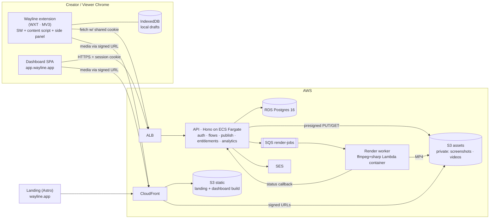
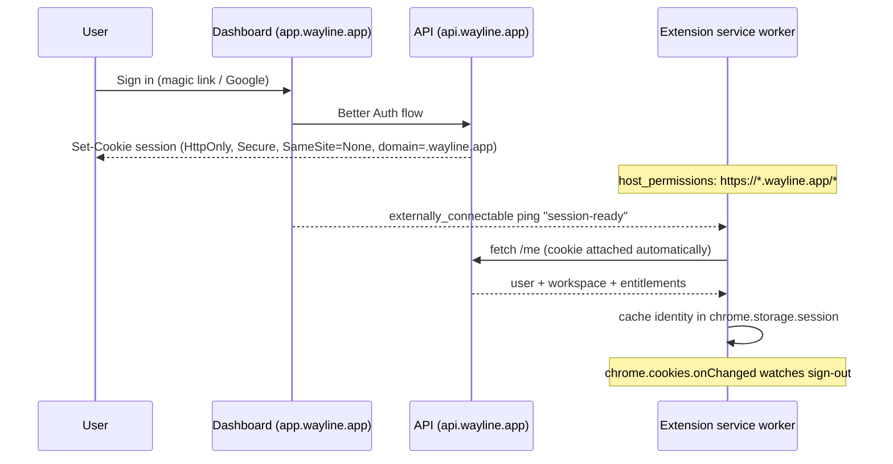
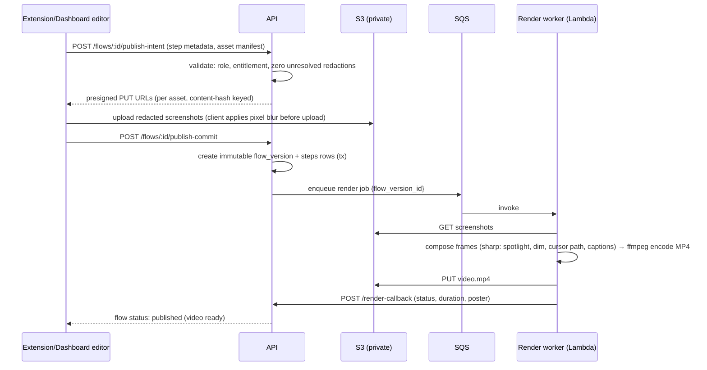

# 03 · System Architecture

## 1. Stack summary (all TypeScript)

| Layer         | Choice                                                             | Why (research-backed)                                                                                                                                                |
| ------------- | ------------------------------------------------------------------ | -------------------------------------------------------------------------------------------------------------------------------------------------------------------- |
| Extension     | **WXT** (MV3)                                                      | Best-maintained framework 2026; first-class side panel/content-script/SW entrypoints; Vite HMR; shadow-DOM UI utilities for overlays. Plasmo is in maintenance mode. |
| Dashboard     | **Vite + React + TanStack Router/Query + shadcn/ui (Tailwind v4)** | Fully-authenticated SPA — SSR is pure overhead; shadcn = own-the-code components themed with Wayline OKLCH tokens.                                                   |
| Landing       | **Astro** (static) → S3 + CloudFront                               | SEO pages with zero server; content-heavy marketing fits Astro islands.                                                                                              |
| API           | **Node 22 + Hono + Zod + Drizzle ORM**                             | Lightweight, typed end-to-end; Drizzle gives SQL-first migrations run as one-off ECS tasks.                                                                          |
| Auth          | **Better Auth** (magic link plugin + Google)                       | Self-hosted, first-class TS, documented browser-extension guide (`trustedOrigins` for `chrome-extension://`), cookie sessions.                                       |
| DB            | **PostgreSQL 16** (RDS)                                            | Boring, right. Same image locally.                                                                                                                                   |
| Queue         | **SQS** (ElasticMQ locally)                                        | Render jobs + analytics batch ingest.                                                                                                                                |
| Render worker | **ffmpeg + sharp in a Lambda container image**                     | 1–3 min silent slideshow MP4s finish well inside Lambda's 15-min cap; pay-per-render; avoids Remotion's $100/mo company-license minimum.                             |
| Assets        | **S3 (private) + CloudFront signed URLs**                          | Short-lived signed URLs; no permanent public asset URLs.                                                                                                             |
| Email         | **SES**                                                            | Magic links, invites, notifications.                                                                                                                                 |
| Monorepo      | **pnpm workspaces + Turborepo**                                    | 6 apps/packages, solo dev — Turborepo territory.                                                                                                                     |

## 2. System diagram

Full infrastructure detail (VPC, subnets, IaC, CI/CD): [07-aws-infrastructure.md](./07-aws-infrastructure.md).

## 3. Authentication architecture

### 3.1 Web (dashboard)

- Better Auth on the API; **server-side sessions** in Postgres; HttpOnly `Secure` cookie scoped to `.wayline.app` (`SameSite=Lax` for the SPA; extension needs `None` — see below).
- Sign-in methods: magic link (SES) and Google OAuth. No passwords.

### 3.2 Extension (the critical flow)

Pattern: **cookie-sharing with the dashboard domain** (the Grammarly/Loom/Scribe pattern), verified as the de-facto category standard.

Rules:

- The extension **never stores tokens**; the HttpOnly cookie is attached by Chrome to `fetch()` against `api.wayline.app` because the extension holds host permission for it. CSRF: API requires a custom header (`X-Wayline-Client`) + validates `Origin` is the dashboard or the extension ID.
- `externally_connectable` restricted to `https://app.wayline.app/*`; used only for "session-ready" / "extension-installed" pings (onboarding checklist detection) — never for secrets.
- Extension identity cache in `chrome.storage.session` only (memory, cleared on browser exit, not exposed to content scripts).
- Sign-out anywhere = session row deleted server-side; `cookies.onChanged` flips the extension to signed-out state.

### 3.3 Authorization

- Every API route resolves `(user, workspace, role)` from session + membership; route-level guards (viewer/creator/admin) + row-level `workspace_id` scoping in every query (Drizzle helper, enforced by lint rule).
- Entitlements (plan limits) evaluated server-side per action — publish checks `published_flow_count < limit` inside the same transaction that creates the version.

## 4. Publish pipeline

- Redaction is applied **client-side, destructively** (pixels blurred in the uploaded image) — the server never receives unredacted originals.
- Published versions are immutable; republish = new version + new render. Assets keyed `workspace/{ws}/flow/{flow}/v{n}/…`.
- Render worker is idempotent per `flow_version_id` (safe SQS redelivery); failure → DLQ + status `render_failed` + retry with backoff.

## 5. Video render design

- Input: ordered steps (screenshot, targetBounds, viewport, caption).
- Per step: normalize to 1920×1080 canvas (letterbox, never crop targets); **scale targetBounds from source viewport → frame coordinates**; sharp composites dim layer + spotlight outline + caption band (step number + instruction) + cursor sprite; cursor animates between consecutive target centers (eased, ~500ms) via interpolated frames; hold ~2.5s per step (reading-time adjusted by caption length).
- ffmpeg: frames → H.264 MP4 (yuv420p, faststart) + WebVTT captions sidecar for the player + poster JPEG.
- Player (dashboard): standard `<video>` + chapter filmstrip from step timestamps; media fetched via CloudFront signed URLs (5-min TTL, re-signed on demand).

## 6. Analytics ingest (summary — full spec in [10-analytics-spec.md](./10-analytics-spec.md))

- Extension/side panel and dashboard player POST batched events to `/events` (session cookie auth; workspace-scoped).
- API validates + writes to `view_events` (Postgres, partitioned by month). At v1 scale, Postgres aggregates are fine; a rollup job (nightly ECS scheduled task) maintains `flow_stats` / `member_flow_completion` tables the dashboard reads.
- No third-party trackers in product surfaces; landing page gets privacy-friendly analytics (Plausible or CloudFront logs) only.

## 7. Key cross-cutting decisions

| Decision        | Choice                                                                                                                                               | Note                                                                             |
| --------------- | ---------------------------------------------------------------------------------------------------------------------------------------------------- | -------------------------------------------------------------------------------- |
| API style       | REST + Zod-validated JSON, OpenAPI generated from routes                                                                                             | Shared `packages/shared-types` Zod schemas consumed by extension + dashboard.    |
| IDs             | UUIDv7 everywhere                                                                                                                                    | Time-ordered, index-friendly.                                                    |
| Migrations      | Drizzle SQL migrations, run as **one-off ECS task before service deploy**; expand/contract only                                                      | See [07-aws-infrastructure.md §CI/CD](./07-aws-infrastructure.md).               |
| Versioning skew | Extension published on CWS can lag days (review times) → API is versioned (`/v1`), server-driven feature flags, additive-only changes within a major | Below 10k users CWS has no staged rollout — design for all-or-nothing publishes. |
| Error tracking  | Sentry (API, dashboard, extension SDKs)                                                                                                              | Free tier to start.                                                              |
| Rate limiting   | Per-session + per-IP token bucket in API middleware (Postgres-backed at v1; Redis only if it becomes hot)                                            | Skip ElastiCache at MVP.                                                         |
