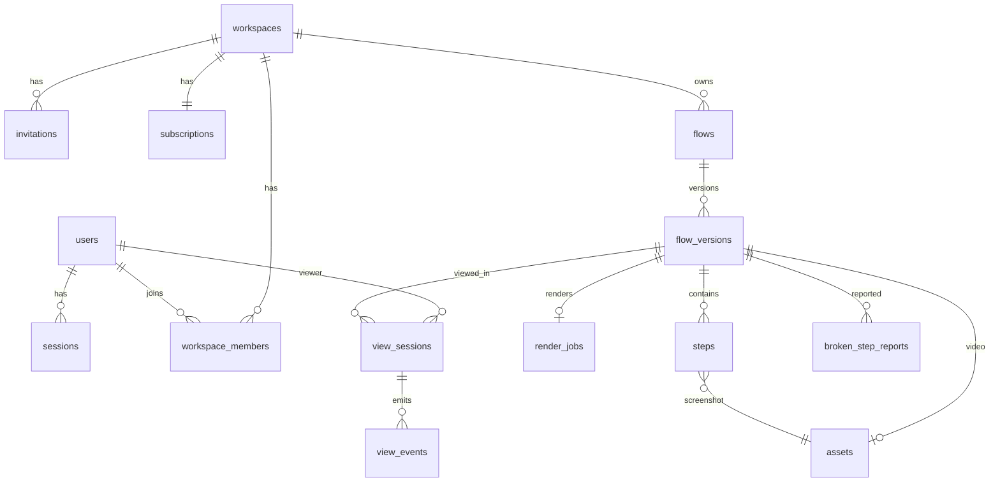

# 04 · Data Model (PostgreSQL 16, Drizzle ORM)

Conventions: UUIDv7 PKs, `created_at`/`updated_at timestamptz` on every table, soft-delete only where noted, every tenant-owned table carries `workspace_id` (FK, indexed) and all queries are workspace-scoped.

## 1. Entity relationship overview

## 2. Identity & tenancy

### users

| column            | type             | notes                   |
| ----------------- | ---------------- | ----------------------- |
| id                | uuid PK          |                         |
| email             | citext unique    |                         |
| name              | text             |                         |
| avatar_url        | text null        | from Google             |
| email_verified_at | timestamptz null | set by first magic link |

Better Auth also owns `sessions` (id, user_id, expires_at, ip, user_agent) and `accounts` (OAuth provider links) — use its Drizzle adapter tables as-is.

### workspaces

| column     | type                       | notes                                              |
| ---------- | -------------------------- | -------------------------------------------------- |
| id         | uuid PK                    |                                                    |
| name       | text                       |                                                    |
| slug       | citext unique              | url-safe                                           |
| plan       | enum `free \| pro \| team` | denormalized from subscription for hot-path checks |
| deleted_at | timestamptz null           | 7-day grace before hard cascade                    |

### workspace_members

| column                 | type                              | notes                                |
| ---------------------- | --------------------------------- | ------------------------------------ |
| workspace_id + user_id | composite PK                      |                                      |
| role                   | enum `admin \| creator \| viewer` |                                      |
| last_active_at         | timestamptz                       | updated by API middleware, throttled |

### invitations

| column                                                       | type                            |
| ------------------------------------------------------------ | ------------------------------- |
| id, workspace_id, email (citext), role, invited_by (user FK) |                                 |
| token_hash                                                   | text — single-use, 7-day expiry |
| accepted_at / revoked_at                                     | timestamptz null                |

### waitlist

`id, email citext unique, source text, invited_at null` — landing-page capture, pre-launch only.

## 3. Flows & steps

### flows

| column             | type                                        | notes                                                                                                 |
| ------------------ | ------------------------------------------- | ----------------------------------------------------------------------------------------------------- |
| id                 | uuid PK                                     |                                                                                                       |
| workspace_id       | uuid FK                                     |                                                                                                       |
| created_by         | uuid FK users                               |                                                                                                       |
| title              | text                                        |                                                                                                       |
| status             | enum `draft_local \| published \| archived` | `draft_local` = placeholder row created at first sync-intent; step data stays on-device until publish |
| current_version_id | uuid FK flow_versions null                  | latest published                                                                                      |
| deleted_at         | timestamptz null                            |                                                                                                       |

### flow_versions (immutable after commit)

| column         | type                                          | notes                     |
| -------------- | --------------------------------------------- | ------------------------- |
| id             | uuid PK                                       |                           |
| flow_id        | uuid FK                                       |                           |
| version        | int                                           | unique (flow_id, version) |
| published_by   | uuid FK users                                 |                           |
| published_at   | timestamptz                                   |                           |
| start_url      | text                                          | walkthrough entry point   |
| step_count     | int                                           |                           |
| video_asset_id | uuid FK assets null                           | set by render callback    |
| video_status   | enum `queued \| rendering \| ready \| failed` |                           |
| duration_ms    | int null                                      |                           |

### steps

| column                 | type                                                            | notes                                                                                                                                                                  |
| ---------------------- | --------------------------------------------------------------- | ---------------------------------------------------------------------------------------------------------------------------------------------------------------------- |
| id                     | uuid PK                                                         |                                                                                                                                                                        |
| flow_version_id        | uuid FK                                                         |                                                                                                                                                                        |
| order                  | int                                                             | unique (flow_version_id, order)                                                                                                                                        |
| instruction            | text                                                            | caption shown in video & guide                                                                                                                                         |
| action                 | enum `click \| input \| select \| submit \| navigate \| manual` |                                                                                                                                                                        |
| url, page_title        | text                                                            |                                                                                                                                                                        |
| viewport_w, viewport_h | int                                                             | source screenshot dimensions                                                                                                                                           |
| screenshot_asset_id    | uuid FK assets                                                  | **already redacted** client-side                                                                                                                                       |
| target_bounds          | jsonb `{x,y,w,h}`                                               | source-viewport coords                                                                                                                                                 |
| target_descriptor      | jsonb                                                           | multi-selector bundle: `{testId?, id?, role?, name?, label?, text?, css?, pierce?, nth?, bbox}` — see [06-extension-spec.md](./06-extension-spec.md#target-resolution) |
| redaction_status       | enum `clear \| resolved`                                        | `warning` never reaches the server — publish is blocked client- and server-side                                                                                        |

> Typed values: no column exists that could hold one. `instruction` is generated/edited text; capture code never serializes field values ([09-security-privacy.md](./09-security-privacy.md)).

### assets

| column                     | type                                             | notes                                          |
| -------------------------- | ------------------------------------------------ | ---------------------------------------------- |
| id                         | uuid PK                                          |                                                |
| workspace_id               | uuid FK                                          |                                                |
| kind                       | enum `screenshot \| video \| poster \| captions` |                                                |
| s3_key                     | text                                             | `workspace/{ws}/flow/{flow}/v{n}/{hash}.{ext}` |
| content_hash               | text                                             | sha-256, dedupe + integrity                    |
| bytes, width, height, mime |                                                  |                                                |

Delivery is always via short-lived CloudFront signed URLs minted by the API after a membership check — `s3_key` is never exposed raw.

### render_jobs

`id, flow_version_id unique, status enum queued|running|succeeded|failed, attempt int, error text null, started_at, finished_at, priority enum normal|high` (high = paid plans). SQS message carries only `render_job_id`; worker is idempotent on it.

### broken_step_reports

`id, flow_version_id, step_id, reported_by, reason enum target_missing|wrong_target|page_changed|other, comment text null, url_at_report text, resolved_at null, resolved_by null`.

## 4. Analytics 

### view_sessions

| column                                 | type                        | notes                                             |
| -------------------------------------- | --------------------------- | ------------------------------------------------- |
| id                                     | uuid PK                     |                                                   |
| workspace_id, flow_version_id, user_id | FKs                         | viewers are always authenticated members          |
| mode                                   | enum `video \| walkthrough` |                                                   |
| started_at, ended_at                   | timestamptz                 |                                                   |
| completed                              | bool                        | video ≥90% watched or walkthrough final step done |
| last_step_order                        | int                         | drop-off point                                    |

### view_events (partitioned by month on occurred_at)

`id, view_session_id, type enum session_start|step_viewed|step_completed|step_skipped|step_retried|paused_target_missing|report_opened|video_play|video_seek|video_complete|session_end, step_order int null, occurred_at, meta jsonb`.

Batched writes; 12-month retention → aggregate then drop old partitions.

### Rollups (nightly job, dashboard reads these)

- `flow_stats(flow_version_id, unique_viewers, video_completion_rate, walkthrough_starts, walkthrough_completions, step_dropoff jsonb)`
- `member_flow_completion(workspace_id, user_id, flow_id, first_completed_at, mode)` — the training-compliance table; CSV export reads it directly.

## 5. Billing & entitlements 

### subscriptions

`id, workspace_id unique, plan enum free|pro|team, status enum active|past_due|canceled, stripe_customer_id null, stripe_subscription_id null, seats int default 1, current_period_end timestamptz null`.
Every workspace gets a `free` row at creation; Stripe fields stay null until the billing sprint.

### Entitlements (code-level table, versioned constant in `packages/shared-types`)

| key                 | free   | pro   | team       |
| ------------------- | ------ | ----- | ---------- |
| max_published_flows | 3      | ∞     | ∞          |
| max_creators        | 1      | 3     | seats      |
| analytics_level     | basic  | steps | compliance |
| custom_branding     | ✗      | ✓     | ✓          |
| version_history     | ✗      | ✓     | ✓          |
| render_priority     | normal | high  | high       |

Enforcement: `assertEntitlement(workspaceId, key)` API helper; publish-count check runs inside the publish transaction (`SELECT count(*) ... FOR UPDATE` on flows) to prevent race-through at the limit.

### audit_log

`id, workspace_id, actor_id, action text, target_type, target_id, meta jsonb, created_at` — member/role/plan/flow-deletion changes. Admin-visible later; write it from day one.

## 6. Local draft data (extension IndexedDB — not server schema)

DB `wayline-drafts`, stores: `drafts` (draft metadata + ordered step records mirroring the `steps` shape plus `redaction_status: 'warning'` and pending redaction rectangles) and `blobs` (screenshot Blobs keyed by content hash, JPEG q0.8). Cleared per-draft on publish or discard. Requires `unlimitedStorage` permission ([06-extension-spec.md](./06-extension-spec.md)).

## 7. Indexing & integrity notes

- Hot paths: `flows(workspace_id, status)`, `flow_versions(flow_id, version desc)`, `steps(flow_version_id, order)`, `view_events(view_session_id)`, `view_sessions(flow_version_id, user_id)`, `workspace_members(user_id)`.
- FKs `on delete cascade` within a workspace tree; workspace hard-delete is a background job after the 7-day grace.
- `citext` for emails/slugs; `pgcrypto` not needed (hashes computed app-side).
- Nightly `pg_dump` to S3 in addition to RDS automated backups + pre-migration manual snapshot ([07-aws-infrastructure.md](./07-aws-infrastructure.md)).
