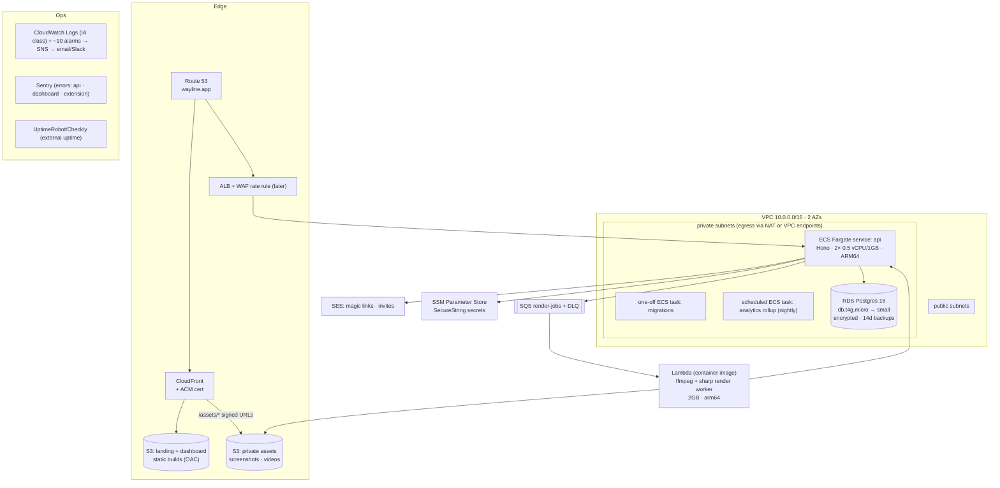

# 07 · AWS Infrastructure & Delivery

Decisions verified against July-2026 state of the ecosystem (IaC licensing, LocalStack repricing, ECS-native blue/green, GitHub OIDC actions).

## 1. Reference architecture



**Environments**: `dev` (real AWS account/profile, scaled to zero-ish) and `prod` — separate accounts under one AWS Organization. Local dev needs no AWS at all ([08-local-dev.md](./08-local-dev.md)).

## 2. Component decisions

| Concern        | Decision                                                                                                                                                                                                                                 | Rationale (2026-verified)                                                                                                           |
| -------------- | ---------------------------------------------------------------------------------------------------------------------------------------------------------------------------------------------------------------------------------------- | ----------------------------------------------------------------------------------------------------------------------------------- |
| API compute    | **ECS Fargate** (ARM64/Graviton, 2 tasks min, autoscale on CPU+ALB RPS)                                                                                                                                                                  | Native ALB integration, no 15-min limits, boring. App Runner considered — less control over networking to RDS.                      |
| Render worker  | **Lambda container image** (10 GB image cap fits ffmpeg; 15-min cap ≫ 1–3 min renders), SQS event source, reserved concurrency cap                                                                                                       | Pay-per-render at MVP volume; escalate to Fargate task runner only if renders outgrow Lambda.                                       |
| Front door     | **ALB** (~$20–30/mo)                                                                                                                                                                                                                     | Native ECS target groups/health checks; API GW only wins for usage-plan/API-key products.                                           |
| DB             | **RDS Postgres 16** single-AZ `db.t4g.micro` at MVP → `small` + Multi-AZ at revenue                                                                                                                                                      | Aurora Serverless v2 floor cost exceeds a t4g.micro at this scale. **Check "storage encrypted" at creation — cannot enable later.** |
| Cache/Redis    | **Skip at MVP**                                                                                                                                                                                                                          | Rate limiting Postgres-backed; add ElastiCache only when measured.                                                                  |
| Media delivery | S3 private + **CloudFront signed URLs** (5-min TTL) via OAC; API mints URLs post-authz                                                                                                                                                   | No permanent asset URLs — product requirement.                                                                                      |
| Email          | **SES**: verify domain + DKIM + custom MAIL FROM, request production access (sandbox exit) week 1; configuration set with bounce/complaint SNS → suppress list. **Alarm on bounce rate** (magic-link auth dies if SES reputation tanks). |
| Secrets        | **SSM Parameter Store SecureString** (free tier) injected via ECS task-definition `secrets` (execution role resolves at start; redeploy to rotate). Secrets Manager only if managed RDS rotation is later wanted.                        |
| WAF            | Defer; add 1 ACL + AWS managed common rules + **rate-based rule** (~$8–15/mo) before public launch.                                                                                                                                      |
| Encryption     | S3 SSE-S3 default (automatic since 2023); RDS encryption at creation; EBS default-encryption flipped on per-region.                                                                                                                      |
| Backups        | RDS automated 14d + PITR; **manual snapshot before every migration** (CI step); nightly `pg_dump` to S3 (cross-account copy later); S3 versioning + lifecycle (noncurrent 30d, abort MPU 7d) on asset buckets.                           |

## 3. IaC — OpenTofu

- **OpenTofu v1.12+** (MPL 2.0 Terraform fork, Linux Foundation): full Terraform-registry compatibility, native S3 state locking (no DynamoDB table), state encryption. Chosen over: Terraform (BSL license), CDK (CloudFormation slowness; fine runner-up), SST v4 (best DX but documented state-corruption/orphaned-resource incidents — disqualifying for solo ops), Pulumi (fine, more moving parts).
- Modules: community `terraform-aws-modules/{vpc,ecs,rds,s3-bucket,cloudfront,sqs,ses}` — this stack is five boring primitives; don't hand-roll.
- Layout:

```
infra/
├─ modules/           # thin wrappers: service, worker, static-site
├─ envs/dev/          # small instance sizes, single NAT
├─ envs/prod/
└─ global/            # Route53 zone, org, OIDC provider, state bucket
```

- State: S3 backend with native locking, one state per env. `tofu plan` on PR (read-only role), `apply` manual via workflow dispatch.

## 4. CI/CD (GitHub Actions)

**Auth: OIDC federation — zero stored AWS keys.** IAM OIDC provider for `token.actions.githubusercontent.com`; deploy role trust-scoped to repo + environment; `aws-actions/configure-aws-credentials@v6`.

### Pipelines

| Trigger                  | Pipeline                                                                                                                       |
| ------------------------ | ------------------------------------------------------------------------------------------------------------------------------ |
| PR                       | Turborepo affected: lint, typecheck, unit tests, build; `tofu plan` if `infra/**`                                              |
| main → api/worker        | build (native `ubuntu-24.04-arm` runners — no QEMU; `type=gha` cache, per-arch scope) → push ECR → **migration gate** → deploy |
| main → dashboard/landing | build → S3 sync → CloudFront invalidation                                                                                      |
| tag `ext-v*`             | build zip → `chrome-webstore-upload-cli` upload+publish → GitHub Release                                                       |
| nightly                  | CWS token dry-run (keeps refresh token alive), dependency audit                                                                |

### Migration gate (before service deploy)

```
aws ecs run-task (same api image, command: ["pnpm","db:migrate"], private subnets)
→ aws ecs wait tasks-stopped (looped past the 10-min waiter cap)
→ exit code 0 required → then amazon-ecs-deploy-task-definition@v2
```

- Never in-entrypoint (replica race, deploy hangs); never from the runner to a public DB.
- **Expand/contract migrations only** — old tasks run against new schema during rolling deploys; pipeline serialized with GitHub `concurrency:` group; manual RDS snapshot step precedes migration.
- Deploys: **rolling + deployment circuit breaker (auto-rollback)**. ECS-native blue/green (GA July 2025) is a config toggle later if needed — skip CodeDeploy entirely.

### ECR hygiene

Basic scan-on-push (free) + Trivy in CI for language-level CVEs; lifecycle policy keep-last-10.

## 5. Observability (minimal honest stack)

1. **CloudWatch Logs, awslogs driver**, one-line JSON; **Infrequent Access class** for app/worker logs ($0.25/GB vs $0.50 — IA supports Logs Insights since early 2026; keep Standard only where metric filters are needed); explicit 30–90d retention.
2. **Sentry** (free dev tier → Team $26/mo): API, dashboard, and extension SDKs; release tagging from CI.
3. **External uptime**: UptimeRobot free or Checkly Hobby against `/healthz` + a synthetic sign-in.
4. **Alarms (~$1/mo, SNS → email/Slack)**: ALB 5xx rate & p99 latency, ECS running-task count < desired, SQS depth & oldest-message age, DLQ non-empty, RDS CPU/storage/connections, Lambda errors/throttles, **SES bounce rate**, billing anomaly.
5. Defer: OTel collector/ADOT, Grafana Cloud, Axiom — until real dashboard needs or CloudWatch ingest > ~$50/mo. Instrument code with OTel-compatible semantics now so a collector can be added without rewrites.

## 6. Cost model (us-east-1, monthly)

| Item                             | MVP (pilot)                                                              | ~1000 active users          |
| -------------------------------- | ------------------------------------------------------------------------ | --------------------------- |
| ECS Fargate api (ARM)            | 2× 0.5vCPU/1GB ≈ **$29**                                                 | 4 tasks + headroom ≈ $60–90 |
| ALB                              | **$20**                                                                  | $25–35                      |
| RDS t4g.micro (→small, Multi-AZ) | **$15**                                                                  | $60–120                     |
| NAT gateway                      | **$33** (or ~$10 with VPC endpoints for S3/ECR/SSM/SQS + fck-nat at dev) | $35–50                      |
| Lambda renders                   | ~pennies (≤1k renders)                                                   | $5–20                       |
| S3 + CloudFront                  | **$5**                                                                   | $20–60                      |
| SQS/SES/SSM/Route53              | **$3**                                                                   | $10                         |
| CloudWatch (IA logs + alarms)    | **$5**                                                                   | $15–30                      |
| Sentry/uptime                    | **$0**                                                                   | $26–35                      |
| **Total**                        | **≈ $110–120/mo**                                                        | **≈ $250–450/mo**           |

Cheapest meaningful cuts at MVP: VPC endpoints instead of NAT for AWS traffic; dev env torn down nightly (`tofu destroy` scheduled or scale-to-zero).

## 7. Delivery runbook (docs to write during Sprint 0/1)

- `runbooks/deploy.md` — normal deploy, rollback (previous task def revision), failed-migration recovery (snapshot restore).
- `runbooks/incidents.md` — alarm → first-response table.
- `runbooks/dr.md` — RDS PITR restore drill (do one before launch), S3 version restore.
- `runbooks/ses.md` — bounce-rate spike response, suppression list.
